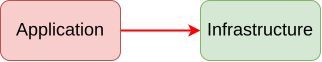
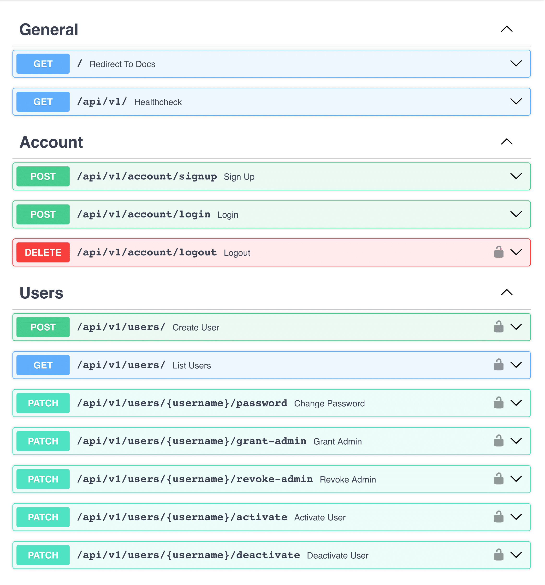

# Overview


### 🚀 How BaseAPI Works

#### 1. Request Processing Flow
When a request hits your API, BaseAPI processes it through several layers:

- **Authentication Layer**: JWT tokens validate user identity
- **Controller Layer**: Route handlers process the request
- **Service Layer**: Business logic executes the operation
- **Database Layer**: SQLAlchemy manages data persistence

#### 2. Background Task Processing
Long-running operations are handled asynchronously:

- Tasks are queued in Redis for processing
- Celery workers pick up and execute tasks
- Results are stored and can be retrieved later
- Email notifications and data processing happen without blocking API responses

#### 3. Payment Processing Workflow
Stripe integration handles the complete payment lifecycle:

- Customer creation and management
- Subscription setup with multiple pricing tiers
- Webhook handling for payment events
- Automatic retry logic for failed payments

## Business Model Support

### Subscription Management
- Multiple subscription tiers with different features
- Automatic billing and renewal handling
- Proration support for plan changes
- Grace period handling for failed payments

### Payment Methods
- Credit card processing through Stripe
- Bank transfer support
- Multiple currency handling
- Automatic invoice generation

## Production Readiness

BaseAPI is designed for production deployment with enterprise-grade features:

- **Docker Support**: Container-ready for Kubernetes deployment
- **Environment Configuration**: Separate configs for development, staging, and production
- **Database Migrations**: Version-controlled schema changes with Alembic
- **Error Handling**: Comprehensive error handling and logging
- **Security**: JWT authentication, CORS configuration, and input validation

## Why Choose BaseAPI?

Traditional API development can take weeks or months to set up properly. BaseAPI eliminates this overhead by providing:

- **Instant Development**: Start building features immediately, not infrastructure
- **Battle-Tested Components**: All integrations are production-ready and thoroughly tested
- **Scalable Architecture**: Modular design supports teams and complex applications
- **Complete Feature Set**: Authentication, payments, background jobs, and email—all included
- **Developer Experience**: Automatic API documentation, type hints, and modern Python practices

# Table of contents

1. [Overview](#overview)
2. [Architecture Principles](#architecture-principles)
    1. [Introduction](#introduction)
    2. [Layered Approach](#layered-approach)
    3. [Dependency Rule](#dependency-rule)
        1. [Note on Adapters](#note-on-adapters)
    4. [Layered Approach Continued](#layered-approach-continued)
    5. [Dependency Inversion](#dependency-inversion)
    6. [Dependency Injection](#dependency-injection)
    7. [CQRS](#cqrs)
3. [Project](#project)
    1. [Dependency Graphs](#dependency-graphs)
    2. [Structure](#structure)
    3. [Technology Stack](#technology-stack)
    4. [API](#api)
        1. [General](#general)
        2. [Account](#account-apiv1account)
        3. [Users](#users-apiv1users)
    5. [Configuration](#configuration)
        1. [Files](#files)
        2. [Flow](#flow)
        3. [Local Environment](#local-environment)
        4. [Other Environments](#other-environments-devprod)
        5. [Adding New Environments](#adding-new-environments)
4. [BaseAPI Integration](#baseapi-integration)
    1. [What is BaseAPI?](#what-is-baseapi)
    2. [Core Features](#core-features)
    3. [Business Model Support](#business-model-support)
    4. [Production Readiness](#production-readiness)
    5. [Why Choose BaseAPI?](#why-choose-baseapi)
5. [Useful Resources](#useful-resources)
6. [Support the Project](#-support-the-project)
7. [Acknowledgements](#acknowledgements)

# Architecture Principles

## Introduction

This repository may be helpful for those seeking a backend implementation in Python that is both framework-agnostic
and storage-agnostic (unlike Django).
Such flexibility can be achieved by using a web framework that doesn't impose strict software design (like FastAPI) and
applying a layered architecture patterned after the one proposed by Robert Martin, which we'll explore further.


<p align="center">
  
  <br><em>Figure 1: <b>Matias Baglieri</b> Clean Architecture Diagram</em>
</p>


The most abstract policies define core business rules, while the least abstract ones handle I/O operations.
Being closer to implementation details, less abstract policies are more likely to change.
A layer represents a collection of components expressing policies at the same level of abstraction.

The concentric circles represent boundaries between different layers.
The meaning of the arrows in the diagram will be discussed [later](#dependency-rule).
For now, we will focus on the purpose of the layers.

## Layered Approach

 **Domain Layer**

- The core of the application, containing **entities**, **value objects**, and **domain services** that encapsulate
  critical business rules — fundamental principles or constraints that define how the business operates and delivers
  value.
  In some cases, these rules can be seen as mechanisms that create the product's value independently of its
  software implementation.
  Changing them often reflects a change in the business itself.
- It establishes a **ubiquitous language** — a consistent terminology shared across the application and domain.
  This is the language you can speak with managers.
- It's the most stable and independent part of the application.
- Domain services originally represent operations that don't naturally belong to a specific entity.
  In projects with anemic domain models — where entities hold data but no behavior — domain services may also include
  logic that would otherwise reside inside those entities.

> [!NOTE]
> The Domain layer may also include **aggregates** (groups of entities that must change together as a single unit,
> defining the boundaries of transactional consistency) and **repository interfaces** (abstractions for manipulating
> aggregates).
> While these concepts aren't implemented in the project's codebase, understanding them can deepen your knowledge of
> DDD.

 **Application Layer**

- This layer implements the application-specific business logic by realizing steps of business-defined _**use cases**_.
- Its main components are **interactors** — each handles a single business operation matching a step within a use case.
- An interactor **orchestrates** domain logic and external calls needed to perform the operation.
- Interactors are stateless, isolated, and do not call each other. Each is invoked independently — typically by external
  drivers such as HTTP controllers, message consumers, or scheduled jobs.
- To access external systems, interactors rely on **interfaces (ports)** that abstract infrastructure details.
- In some cases, **application services** may group related interactors under a common business context.
- The layer may also include standalone services for non-orchestration logic, such as authorization.

> [!NOTE]
> Domain and Application layers may import external tools and libraries to the extent necessary for describing business
> logic — such as utilities for numerical computations, timezone management, or object modeling that extend the
> language's capabilities.
> However, they should avoid any ties to specific frameworks, databases, or external systems.

 **Infrastructure Layer**

- This layer is responsible for _**adapting**_ the application to external systems.
- It provides **implementations (adapters)** for the interfaces (ports) defined in the Application layer,
  allowing the application to interact with external systems like databases, APIs, and file systems while keeping the
  business logic decoupled from them.
- Related adapter logic can be grouped into an **infrastructure service**.

> [!IMPORTANT]
> - Clean Architecture doesn't prescribe any particular number of layers.
    The key is to follow the Dependency Rule, which is explained in the next section.

## Dependency Rule

A dependency occurs when one software component relies on another to operate.
If you were to split all blocks of code into separate modules, dependencies would manifest as imports between those
modules. Typically, dependencies are graphically depicted in UML style in such a way that

> [!IMPORTANT]
> - `A -> B` (**A points to B**) means **A depends on B**.

The key principle of Clean Architecture is the **Dependency Rule**.
This rule states that **more abstract software components must not depend on more concrete ones.**
In other words, dependencies must never point outwards within the application's boundaries.

> [!IMPORTANT]
> - Components within the same layer **can depend on each other.** For example, components in the Infrastructure layer
    can interact with one another without crossing into other layers.
>
> - Components in any outer layer can depend on components in **any** inner layer, not necessarily the one closest to
    them. For example, components in the Presentation layer can directly depend on the Domain layer, bypassing the
    Application and Infrastructure layers.
>
> - Avoid letting business logic leak into peripheral details, such as raising business-specific exceptions in the
    Infrastructure layer without re-raising them in the business logic or declaring domain rules outside the Domain
    layer.
>
> - In specific cases where database constraints enforce business rules, the Infrastructure layer may raise
    domain-specific exceptions, such as `UsernameAlreadyExistsError` for a `UNIQUE CONSTRAINT` violation.
    Handling these exceptions in the Application layer ensures that any business logic implemented in adapters remains
    under control.
>
> - Avoid introducing elements in inner layers that specifically exist to support outer layers.
    For example, you might be tempted to place something in the Application layer that exists solely to support a
    specific piece of infrastructure.
    At first glance, based on imports, it might seem that the Dependency Rule isn't violated. However, in reality,
    you've broken the core idea of the rule by embedding infrastructure concerns (more concrete) into the business logic
    (more abstract).

### Note on Adapters

The **Infrastructure layer** in the Clean Architecture acts as the adapter layer — connecting the application to
external systems.
In this project, we treat both **Infrastructure** and **Presentation** as adapters, since both adapt the application to
the outside world.
Speaking of dependencies direction, the diagram by R. Martin in Figure 1 can, without significant loss, be replaced by a
more concise and pragmatic one — where the adapter layer serves as a bridge, depending both on the internal layers of
the application and external components.
This adjustment implies **reversing** the arrow from the blue layer to the green layer in R. Martin's diagram.

The proposed solution is a **trade-off**.
It doesn't strictly follow R. Martin's original concept but avoids introducing excessive abstractions with
implementations outside the application's boundaries.
Pursuing purity on the outermost layer is more likely to result in overengineering than in practical gains.

My approach retains nearly all the advantages of Clean Architecture while simplifying real-world development.
When needed, adapters can be removed along with the external components they're written for, which isn't a
significant issue.

Let's agree, for this project, that Dependency Rule **does not apply to adapters**.

<div style="display: grid; grid-template-columns: repeat(auto-fit, minmax(400px, 1fr)); gap: 10px; justify-items: center;">
  
  
</div>
<p align="center" style="font-size: 14px;">
  <em>Figure 2: <b>My Pragmatic Interpretation</b> of Clean Architecture<br>
  (diagrammed — original and alternative representation)
  </em>
</p>

## Layered Approach Continued

 **Presentation Layer**

> [!NOTE]
> In the original diagram, the Presentation layer isn't explicitly distinguished and is instead included within the
> Interface Adapters layer. I chose to introduce it as a separate layer, marked in blue, as I see it as even more
> external compared to typical adapters.

- This layer handles external requests and includes **controllers** that validate inputs and pass them to the
  interactors in the Application layer. The more abstract layers of the program assume that request data is already
  validated, allowing them to focus solely on their core logic.
- Controllers must be as thin as possible, containing no logic beyond basic input validation and routing. Their
  role is to act as an intermediary between the application and external systems (e.g., FastAPI).

> [!IMPORTANT]
> - **_Basic_** validation, like checking whether the structure of the incoming request matches the structure of the
    defined request model (e.g., type safety and required fields) should be performed by controllers at this layer,
    while **_business rule_** validation (e.g., ensuring the email domain is allowed, verifying the uniqueness of
    username, or checking if a user meets the required age) belongs to the Domain or Application layer.
> - Business rule validation often involves relationships between fields, such as ensuring that a discount applies only
    within a specific date range or a promotion code is valid for orders above a certain total.
> - **Carefully** consider using Pydantic for business rule validation. While convenient, Pydantic models are slower
    than regular dataclasses and reduce application core stability by coupling business logic to an external library.
> - If you choose Pydantic (or a similar tool bundled with web framework) for business model definitions, ensure that
    a Pydantic model in business layers is a separate model from the one in the Presentation layer, even if their
    structure appears identical. Mixing data presentation logic with business logic is a common mistake made early in
    development to save effort on creating separate models and field mapping, often due to not understanding that
    structural similarities are temporary.

 **External Layer**

> [!NOTE]
> In the original diagram, the external components are included in the blue layer (Frameworks & Drivers).
> I've marked them in gray to clearly distinguish them from the layers within the application's boundaries.

- This layer represents fully external components such as web frameworks (e.g. FastAPI itself), databases, third-party
  APIs, and other services.
- These components operate outside the application’s core logic and can be easily replaced or modified without affecting
  the business rules, as they interact with the application only through the Presentation and Infrastructure layers.

<p align="center">
  
  <br><em>Figure 3: Basic Dependency Graph</em>
</p>

## Dependency Inversion

The **dependency inversion** technique enables reversing dependencies **by introducing an interface** between
components, allowing the inner layer to communicate with the outer layer while adhering to the Dependency Rule.

<p align="center">
  
  <br><em>Figure 4: <b>Corrupted</b> Dependency</em>
</p>

In this example, the Application component depends directly on the Infrastructure component, violating the Dependency
Rule.
This creates "corrupted" dependencies, where changes in the Infrastructure layer can propagate to and unintentionally
affect the Application layer.

<p align="center">
  
  <br><em>Figure 5: <b>Correct</b> Dependency</em>
</p>

In the correct design, the Application layer component depends on an **abstraction (port)**, and the Infrastructure
layer component **implements** the corresponding interface.
This makes the Infrastructure component an adapter for the port, effectively turning it into a plugin for the
Application layer.
Such a design adheres to the **Dependency Inversion Principle (DIP)**, minimizing the impact of infrastructure changes
on the core business logic.

## Dependency Injection

The idea behind **Dependency Injection** is that a component shouldn't create the dependencies it needs but rather
receive them.
From this definition, it's clear that one common way to implement DI is by passing dependencies as arguments to the
`__init__` method or functions.

But how exactly should these dependencies be initialized (and finalized)?

**DI frameworks** offer an elegant solution by automatically creating the necessary objects (while managing their
**lifecycle**) and injecting them where needed.
This makes the process of dependency injection much cleaner and easier to manage.

<p align="center">
  
  <br><em>Figure 6: <b>Correct</b> Dependency <b>with DI</b></em>
</p>

FastAPI provides a built-in **DI mechanism** called [Depends](https://fastapi.tiangolo.com/tutorial/dependencies/),
which tends to leak into different layers of the application. This creates tight coupling to FastAPI, violating the
principles of Clean Architecture, where the web framework belongs to the outermost layer and should remain easily
replaceable.

Refactoring the codebase to remove `Depends` when switching frameworks can be unnecessarily costly. It also has [other
limitations](https://dishka.readthedocs.io/en/stable/alternatives.html#why-not-fastapi) that are beyond the scope of
this README. Personally, I prefer [**Dishka**](https://dishka.readthedocs.io/en/stable/index.html) — a solution that
avoids these issues and remains framework-agnostic.

## CQRS

The project implements Command Query Responsibility Segregation (**CQRS**) — a pattern that separates read and write
operations into distinct paths.

- **Commands** (via interactors) handle write operations and business-critical reads using command gateways that work
  with entities and value objects.
- **Queries** are implemented through query services (similar contract to interactors) that use query gateways to fetch
  data optimized for presentation as query models.

This separation enables:

- Efficient read operations through specialized query gates, avoiding loading complete entity models.
- Performance optimization by tailoring data retrieval to specific view requirements.
- Flexibility to combine data from multiple models in read operations with minimal field selection.

# Project

## Dependency Graphs

<details>
  <summary>Application Controller - Interactor</summary>

  <p align="center">
  
  <br><em>Figure 7: Application Controller - Interactor</em>
  </p>

In the presentation layer, a Pydantic model appears when working with FastAPI and detailed information needs to be
displayed in OpenAPI documentation.
You might also find it convenient to validate certain fields using Pydantic;
however, be cautious to avoid leaking business rules into the presentation layer.

For request data, a plain `dataclass` is often sufficient.
Unlike lighter alternatives, it provides attribute access, which is more convenient for working in the application
layer.
However, such access is unnecessary for data returned to the client, where a `TypedDict` is sufficient (it's
approximately twice as fast to create as a dataclass with slots, with comparable access times).

</details>

<details>
  <summary>Application Interactor</summary>

  <p align="center">
  
  <br><em>Figure 8: Application Interactor</em>
  </p>

</details>

<details>
  <summary>Application Interactor - Adapter</summary>

  <p align="center">
  
  <br><em>Figure 9: Application Interactor - Adapter</em>
  </p>

</details>

<details>
  <summary>Domain - Adapter</summary>

  <p align="center">
  
  <br><em>Figure 10: Domain - Adapter</em>
  </p>

</details>

<details>
  <summary>Infrastructure Controller - Handler</summary>
  <p align="center">
  
  <br><em>Figure 11: Infrastructure Controller - Handler</em>
  </p>

An infrastructure handler may be required as a temporary solution in cases where a separate context exists but isn't
physically separated into a distinct domain (e.g., not implemented as a standalone module within a monolithic
application).
In such cases, the handler operates as an application-level interactor but resides in the infrastructure layer.

Initially, I called these handlers interactors, but the community reacted very negatively to the idea of interactors in
the infrastructure layer, refusing to acknowledge that these essentially belong to another context.

In this application, such handlers include those managing user accounts, such as registration, login, and logout.

</details>

<details>
  <summary>Infrastructure Handler</summary>
  <p align="center">
  
  <br><em>Figure 12: Infrastructure Handler</em>
  </p>

Ports in infrastructure are not commonly seen — typically, only concrete implementations are present.
However, in this project, since we have a separate layer of adapters (presentation) located outside the infrastructure,
ports are necessary to comply with the dependency rule.

</details>

<details>

**Identity Provider (IdP)** abstracts authentication details, linking the main business context with the authentication
context. In this example, the authentication context is not physically separated, making it an infrastructure detail.
However, it can potentially evolve into a separate domain.

  <summary>Identity Provider</summary>
  <p align="center">
  
  <br><em>Figure 13: Identity Provider</em>
  </p>

Normally, IdP is expected to provide all information about current user.
However, in this project, since roles are not stored in sessions or tokens, retrieving them in main context was more
natural.

</details>

## Structure

```
.
├── config/...                                   # configuration files and scripts, includes Docker
├── Makefile                                     # shortcuts for setup and common tasks
├── scripts/...                                  # helper scripts
├── pyproject.toml                               # tooling and environment config (uv)
├── ...
└── src/
    └── app/
        ├── domain/                              # domain layer
        │   ├── services/...                     # domain layer services
        │   ├── entities/...                     # entities (have identity)
        │   │   ├── base.py                      # base declarations
        │   │   └── ...                          # concrete entities
        │   ├── value_objects/...                # value objects (no identity)
        │   │   ├── base.py                      # base declarations
        │   │   └── ...                          # concrete value objects
        │   └── ...                              # ports, enums, exceptions, etc.
        │
        ├── application/...                      # application layer
        │   ├── commands/                        # write ops, business-critical reads
        │   │   ├── create_user.py               # interactor
        │   │   └── ...                          # other interactors
        │   ├── queries/                         # optimized read operations
        │   │   ├── list_users.py                # query service
        │   │   └── ...                          # other query services
        │   └── common/                          # common layer objects
        │       ├── services/...                 # authorization, etc.
        │       └── ...                          # ports, exceptions, etc.
        │
        ├── infrastructure/...                   # infrastructure layer
        │   ├── adapters/...                     # port adapters
        │   ├── auth/...                         # auth context (session-based)
        │   └── ...                              # persistence, exceptions, etc.
        │
        ├── presentation/...                     # presentation layer
        │   └── http/                            # http interface
        │       ├── auth/...                     # web auth logic
        │       ├── controllers/...              # controllers and routers
        │       └── errors/...                   # error handling helpers
        │
        ├── setup/
        │   ├── ioc/...                          # dependency injection setup
        │   ├── config/...                       # app settings
        │   └── app_factory.py                   # app builder
        │  
        └── run.py                               # app entry point
```

## Technology Stack

- **Python**: `3.12`
- **Core**: `alembic`, `alembic-postgresql-enum`, `bcrypt`, `dishka`, `fastapi-error-map`, `fastapi`, `orjson`,
  `psycopg3[binary]`, `pydantic[email]`, `pyjwt[crypto]`, `rtoml`, `sqlalchemy[mypy]`, `uuid6`, `uvicorn`, `uvloop`
- **Development**: `mypy`, `pre-commit`, `ruff`, `slotscheck`
- **Testing**: `coverage`, `line-profiler`, `pytest`, `pytest-asyncio`

## API

<p align="center">
  
  <br><em>Figure 14: Handlers</em>
</p>

### General

- `/`: Open to **everyone**.
    - Redirects to Swagger documentation.
- `/api/v1/`: Open to **everyone**.
    - Returns `200 OK` if the API is alive.

### Account (`/api/v1/account`)

- `/signup`: Open to **everyone**.
    - Registers a new user with validation and uniqueness checks.
    - Passwords are peppered, salted, and stored as hashes.
    - A logged-in user cannot sign up until the session expires or is terminated.
- `/login`: Open to **everyone**.
    - Authenticates registered user, sets a JWT access token with a session ID in cookies, and creates a session.
    - A logged-in user cannot log in again until the session expires or is terminated.
    - Authentication renews automatically when accessing protected routes before expiration.
    - If the JWT is invalid, expired, or the session is terminated, the user loses authentication. [^1]
- `/logout`: Open to **authenticated users**.
    - Logs the user out by deleting the JWT access token from cookies and removing the session from the database.

### Users (`/api/v1/users`)

- `/` (POST): Open to **admins**.
    - Creates a new user, including admins, if the username is unique.
    - Only super admins can create new admins.
- `/` (GET): Open to **admins**.
    - Retrieves a paginated list of existing users with relevant information.
- `/{username}/password`: Open to **authenticated users**.
    - Changes the user's password.
    - The current user can change their own password.
    - Admins can change passwords of subordinate users.
- `/{username}/grant-admin`: Open to **super admins**.
    - Grants admin rights to a specified user.
    - Super admin rights can not be changed.
- `/{username}/revoke-admin`: Open to **super admins**.
    - Revokes admin rights from a specified user.
    - Super admin rights can not be changed.
- `/{username}/activate`: Open to **admins**.
    - Restores a previously soft-deleted user.
    - Only super admins can activate other admins.
- `/{username}/deactivate`: Open to **admins**.
    - Soft-deletes an existing user, making that user inactive.
    - Also deletes the user's sessions.
    - Only super admins can deactivate other admins.
    - Super admins cannot be soft-deleted.

> [!NOTE]
> - Super admin privileges must be initially granted manually (e.g., directly in the database), though the user
    account itself can be created through the API.

## Configuration

> [!WARNING]
> - This part of documentation is **not** related to the architecture approach.
> - Use any configuration method you prefer.

### Files

- **config.toml**: Main application settings organized in sections
- **export.toml**: Lists fields to export to .env (`export.fields = ["postgres.USER", "postgres.PASSWORD", ...]`)
- **.secrets.toml**: Optional sensitive data (same format as config.toml, merged with main config)

> [!IMPORTANT]
> - This project includes secret files for demonstration purposes only. In a real project, you **must** ensure that
    `.secrets.toml` and all `.env` files are not tracked by version control system to prevent exposing sensitive
    information. See this project's `.gitignore` for an example of how to properly exclude these sensitive files from
    Git.

### Flow

In this project I use my own configuration system based on TOML files as the single source of truth.
The system generates `.env` files for Docker and infrastructure components while the application reads settings directly
from the structured TOML files. More details are available at https://github.com/ivan-borovets/toml-config-manager

<p align="center">
  
  <br><em>Figure 15: Configuration flow </em>
  <br><small>Here, the arrows represent usage flow, <b>not dependencies.</b></small>
</p>

### Local Environment

1. Configure local environment

* Create `.secrets.toml` in `config/local` following `.secrets.toml.example`
* Edit TOML files in `config/local` according to your project requirements
* When using Docker Compose, remember to pass `APP_ENV` to your service:

```yaml
services:
  app:
    # ...
    environment:
      APP_ENV: ${APP_ENV}
```

* `.env.local` will be generated later — **don't** create it manually

2. Set environment variable

```shell
export APP_ENV=local
# export APP_ENV=dev
# export APP_ENV=prod
```

3. Check it and generate `.env`

```shell
# Probably you'll need Python 3.12 installed on your system to run these commands. 
# The next code section provides commands for its fast installation.
make env  # should print APP_ENV=local
make dotenv  # should tell you where .env.local was generated
```

4. Set up virtual environment

```shell
# sudo apt update
# sudo apt install pipx
# pipx ensurepath
# pipx install uv
# uv python install 3.12
uv v
source .venv/bin/activate
# .venv\Scripts\activate  # Windows
# https://docs.astral.sh/uv/getting-started/installation/#shell-autocompletion
uv pip install -e '.[dev,test]'
```

Don't forget to tell your IDE where the interpreter is located.

Install pre-commit hooks:

```shell
# https://pre-commit.com/
pre-commit install
```

5. Launch

- To run only the database in Docker and use the app locally, use the following command:

    ```shell
    make up.db
    # make up.db-echo
    ```

- Then, apply the migrations:
    ```shell
    alembic upgrade head
    ```

- After applying the migrations, the database is ready, and you can launch the application locally (e.g., through your
  IDE). Remember to set the `APP_ENV` environment variable in your IDE's run configuration.

- To run via Docker Compose:

    ```shell
    make up
    # make up.echo
    ```

  In this case, migrations will be applied automatically at startup.

6. Shutdown

- To stop the containers, use:
    ```shell
    make down
    ```

### Other Environments (dev/prod)

1. Use the instructions about [local environment](#local-environment) above

* But make sure you've created similar structure in `config/dev` or `config/prod` with [files](#files):
    * `config.toml`
    * `.secrets.toml`
    * `export.toml`
    * `docker-compose.yaml` if needed
* `.env.dev` or `.env.prod` to be generated later — **don't** create them manually

### Adding New Environments

1. Add new value to `ValidEnvs` enum in `config/toml_config_manager.py` (and maybe in your app settings)
2. Update `ENV_TO_DIR_PATHS` mapping in the same file (and maybe in your app settings)
3. Create corresponding directory in `config/` folder
4. Add required configuration [files](#files)

Environment directories can also contain other env-specific files like `docker-compose.yaml`, which will be used by
Makefile commands.

# ⭐ Support the Project

If you find this project useful, please give it a star or share it!
Your support means a lot.

👉 Check out the amazing [fastapi-error-map](https://github.com/ivan-borovets/fastapi-error-map), used here to enable
contextual, per-route error handling with automatic OpenAPI schema generation.

💬 Feel free to open issues, ask questions, or submit pull requests.

# Todo

- [x] set up CI
- [x] simplify settings
- [x] simplify annotations
- [ ] add integration tests
- [ ] explain code

[^1]: Session and token share the same expiry time, avoiding database reads if the token is expired.
This scheme of using JWT **is not** related to OAuth 2.0 and is a custom micro-optimization.

---

# BaseAPI Integration

## What is BaseAPI?

BaseAPI is a comprehensive backend framework that eliminates the complexity of building scalable, secure web applications from scratch. Built on FastAPI's high-performance foundation, it provides everything you need to launch production-grade APIs in minutes, not months.

### 🎯 Overview

BaseAPI is more than just a boilerplate—it's a complete development ecosystem that combines the speed of FastAPI with enterprise-grade features. Think of it as your technical co-founder in a box, providing authentication, payment processing, background tasks, and database management out of the box.

### ✅ Perfect For:
- SaaS Applications requiring subscription management and payment processing
- Startups needing a robust, scalable backend without extensive development time
- Development Teams building APIs for web and mobile applications
- MVPs that need to move fast while maintaining production quality

## Core Features

<div align="center">

| Feature | What It Does | How It Works |
|:--------|:------------|:------------|
| 🔐 **JWT Authentication** | Secure user sessions with industry-standard tokens | Uses python-jose library to generate and verify JWT tokens with configurable expiration |
| 💳 **Stripe Integration** | Complete payment and subscription processing | Built-in Stripe SDK integration with webhook handling for payments, subscriptions, and billing events |
| ⚙️ **Background Tasks** | Handle long-running processes without blocking requests | Celery + Redis implementation for email sending, data processing, and scheduled jobs |
| 🗃️ **Database Management** | Full MySQL integration with migrations | SQLAlchemy ORM with Alembic migrations for schema versioning and database evolution |
| 📧 **Email System** | Automated email delivery with templates | Mailgun integration with development mode for testing and production-ready templates |
| 🏗️ **Modular Architecture** | Clean, maintainable code structure | Follows FastAPI best practices with separated controllers, services, and models |

</div>


<div align="center">
BaseAPI transforms months of backend development into minutes of configuration. Whether you're building your first startup or your hundredth API, BaseAPI provides the solid foundation you need to focus on what matters most—your unique business logic.

Made with ❤️ by Matias Baglieri
</div>
